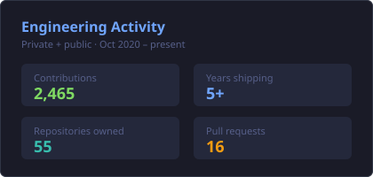
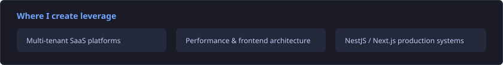

  

  
  &nbsp;
  
  &nbsp;
  
  &nbsp;
  

 

  <h3>Full-Stack Web Engineer from Tunisia</h3>
  

    Building high-performance, scalable web apps with <strong>NestJS</strong>, <strong>Next.js</strong>, and <strong>Vue / Nuxt</strong>. 
    Open to remote | English &amp; French
  

---

### Selected impact

| Role / product | Outcome |
|----------------|---------|
| **RightGive** / Islam Channel | Owned the donation platform (Nuxt 3 PWA). Production traffic validated performance, SEO, and real-time donor UX. |
| **Hero Labs** | Led CRA to Next.js + React Query migration. **~25% faster** page loads; raised frontend architecture bar for the team. |
| **[mypay.tn](https://mypay.tn)** | Built payroll SaaS end-to-end (tax engines CNSS/CSS/IRPP, auth, analytics, Dockerized API). |
| **Engineering practice** | Code review ownership, mentoring, and standards that keep teams shipping safely. |

---

### Open source

Flagship: **[TenantForge](https://github.com/hammouda997/TenantForge)** - multi-tenant SaaS reference (NestJS, Next.js, Prisma, Stripe, RBAC, audit, CI).

| Library / kit | Purpose |
|---------------|---------|
| [nestjs-tenant-guard](https://github.com/hammouda997/nestjs-tenant-guard) | Tenant isolation for NestJS |
| [next-saas-starter-ui](https://github.com/hammouda997/next-saas-starter-ui) | Production SaaS UI shell |
| [saas-docker-ci-kit](https://github.com/hammouda997/saas-docker-ci-kit) | Docker + GitHub Actions for monorepos |

---

### Stack I hire for

  

Additional

 

---

### GitHub

  <table align="center">
    <tr>
      <td align="center" valign="top">
        
      </td>
      <td align="center" valign="top">
        
      </td>
    </tr>
  </table>

 

  

  

